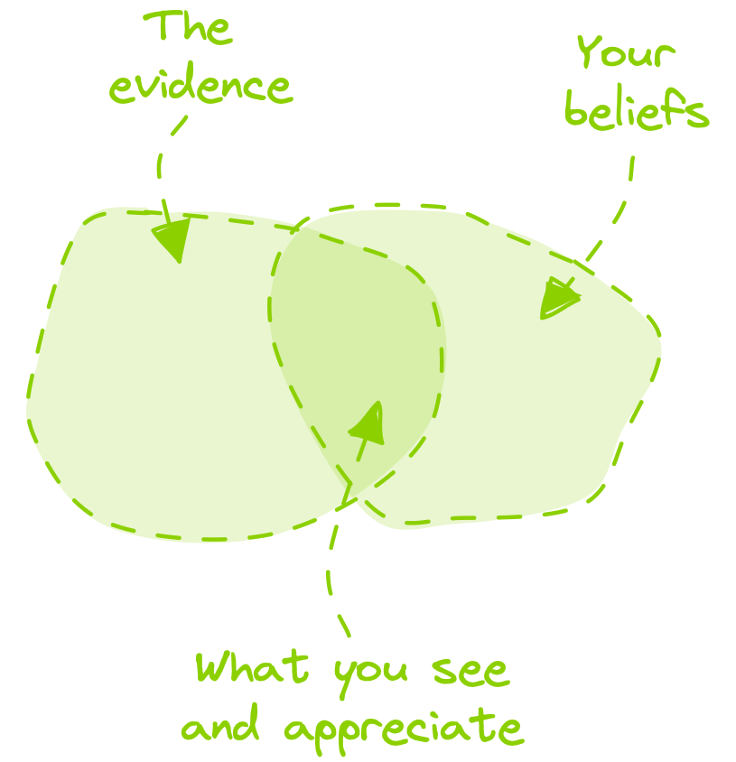
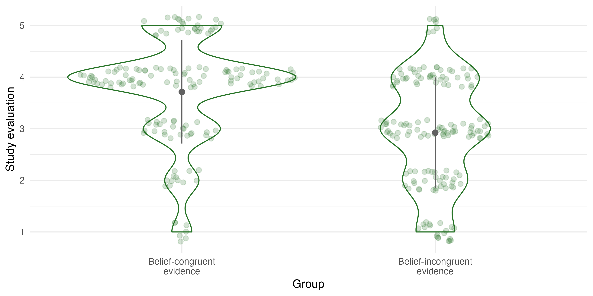
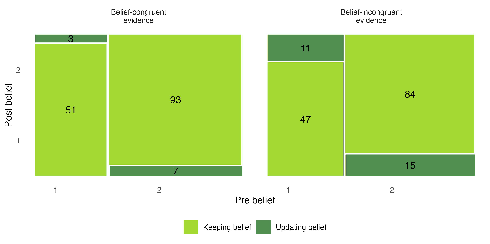
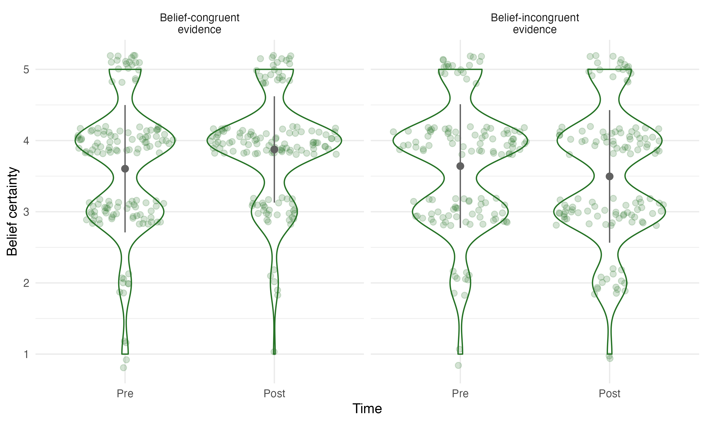

## Overview  {.smaller .center} 


```{r }
#| label: libraries
#| echo: false

# z.B. library(tidyverse)
```


* Evidence-informed school practice
* Confirmation bias 
* Experimental study
  * Sample
  * Design and materials
  * Research questions
  * Results
* Discussion
* References

<!--
::: footer
 Slides cc-by  following !KURZLINK!
:::
-->

::: notes

in a classical manner short theoretical introduction, before focusing in more detail on our experiment

::: 

## Evidence-informed school practice {.smaller}

> Teachers' professional competence involves, among others, considering scientific findings [ @bauer2015; @bromme2014; @slavin2002]

<!--

<center> _adapted.png){width=200}</center>

--> 

* However, teachers often do not rely on evidence in their practice [e.g., @dagenais2012] due to diverse challenges on the ...
  * ... research knowledge level (e.g., comprehensibility of evidence)
  * ... school organizational level (e.g., limited time)
  * ... communication level (e.g., missing cooperation between teachers and researchers)
  * ... individual teacher level (e.g., unfavorable beliefs) <br>
  [@schaik2018]

<!-- Fontsize Quelle kleiner -->

::: notes

- As most of you may know: Considering evidence in teaching practice is part of teachers' professional competence
- when considering such evidence, e.g., in lessons planing - we speak of evidence-informed practice which can improve teaching quality or students learning
- However, teachers often do not rely on such evidence
- Prior reasearch shows that the reasons are diverse and can be clustered into different levels such as the 1) research knowledge level - how evidence is communicated - or individual teacher level - e.g., teachers beliefs


::: 

## Evidence-informed school practice {.smaller}

> Teachers' professional competence involves, among others, considering scientific findings [@bauer2015; @bromme2014; @slavin2002]

<!--
<center> _adapted.png){width=200}</center>
--> 

* However, teachers often do not rely on evidence in their practice [e.g., @dagenais2012] due to diverse problems on the ...
  * ... *research knowledge level (e.g., comprehensibility of evidence) &rarr; focus of the next presentation*
  * ... school organizational level (e.g., limited time)
  * ... communication level (e.g., missing cooperation between teachers and researchers)
  * ... **individual teacher level (e.g., unfavorable beliefs)** <br>
  [@schaik2018]


::: notes

- while in the next presentation my colleague Florian will focus on the research knowledge level, I will focus on the individual level. 
- when thinking of teachers' beliefs about educational research, previous research shows that educational misconceptions and myths are widespread and hard to debunk, and thus can be a barrier for EIP. One explanation for sticking to unfavorable beliefs might be the so-called confirmation bias 

:::

## Confirmation bias {.smaller}

:::: {.columns}

::: {.column width='55%'}
<!-- &#x2011; ist der "no linebreak hyphen" - sonst bleibt nur das Minus in der Zeile -->
* Confirmation bias = prior beliefs distort searching, interpreting and reminding information [e.g., @hart2009; @nickerson1998; @oswald2004; @stroud2017]
  * Information **congruent** with one's beliefs is preferred, perceived as more validating, and better remembered.
  * Information **incongruent** with one's beliefs is avoided/ignored, more quickly devalued, questioned, scrutinized for errors, and poorly remembered.
  
:::

::: {.column width='45%'}
{} 
:::

::::

::: notes

- Confirmation bias means that prior beliefs distort searching, interpreting and reminding information
- Thus, confirmation bias has different components - focus on component of interpreting evidence 
- more specifically information that is congruent with ones own prior beliefs is perceived as more validating
- Contrary, information that is incongruent with ones own beliefs is more quickly devalued or questioned

:::

## Confirmation bias in educational contexts {.smaller}

(Pre-service) teachers' beliefs influence ... 

* ... the evaluation of scientific/research studies [@masnick2009]
* ... their trust in claims from educational research [@schmidt2022]
* ... their evaluation of the potency of educational research findings [(»scientific impotence excuse«) @futterleib2022; @thomm2021].

::: {.fragment}
> []{.imp2} However, students update their beliefs in line with belief-incongruent evidence [@futterleib2022; @thomm2021]
:::

<!-- 
  + []{.imp2} Results could not be replicated consistently [see study 2 by @futterleib2022]
-->

::: notes 

- little research on ConfBias exists in educational context
- The few studies that exist indicate that confirmation bias influences the engagement with evidence: 

<!-- 
  - Student teachers devalue the quality of educational research studies and also question the potency of educational research findings when they are incongruent to their beliefs 
  
--> 

  - To give an example: in-service teachers trust claims from educational research less if they are incongruent than congruent to their beliefs 
- But surprisingly two studies found that student teachers update their beliefs in line with belief-incongruent evidence
  
- Thus, we wanted to see whether we could conceptually replicate this discrepancy between distortet interpretation / evaluation and belief updating.

::: 

## Research questions {.smaller}

**Research question 1:** do student teachers' prior beliefs influence their evaluation of study results?

<br>

<!--
> *H1*: Student teachers consider study results congruent with their beliefs to be more convining than those that contradict their beliefs.
--> 

**Research question 2:** do student teachers update their beliefs in line with the evidence?

<br> 

<!--
> *H2*: Student teachers update their belief direction in line with belief-incongruent evidence.
--> 

**Research question 3:** to what extent does the (in-)congruency of belief and evidence influence student teachers' certainty in their beliefs?

<!--
> *H3*: After reading belief-congruent study results, student teachers are more certain of their initial beliefs..
--> 

<!--
**Research question 4:** To what extent does the (in-)congruency of belief and evidence influence student teachers' updating regarding intention to act? (exploratory) 

-->


::: notes

- hence, we asked whether
   + 1) student teachers' prior beliefs influence the evaluation of study results
   + 2) they update their beliefs in line with the eivdence
   + 3) and to what extent the in(congruency) of belief and evidence influences student teachers certainty in their beliefs - as research on ConfBias more generally shows that the more certain people are in their belief, the more likely they'll stick to it after receiving information that contradicts their belief

::: 

# Experimental study


::: notes 

- to answer these questions we conducted a between person experiment ...

::: 

## Sample 

* *N* = 311 student teachers from a German university
* 80% of the students are female students
* 56% of the students are in their second semester 
* Various teacher training courses (e.g., 67% of the students are studying a Bachelors' degree in primary school teaching)
* Diverse teaching subjects (e.g., 36% at least one subject in mathematics, natural sciences, or technology)

::: notes 

... with 311 student teachers from a German university with different (academic) backgrounds 

::: 

## Design and material {.smaller .scrollable}

* Between-person design
  + Topic "__gender-sensitive language in school__": Does the usage of generic masculine leads to a disproportionate association with male students (male bias) among teachers?
  + Vignette informing about an experimental study that either finds or does not find a male bias
* Dependent Variables
  + __Belief direction__: I believe that the use of the masculine form...
     + … leads to an disproportionate association with male students.
     + … does not lead to an disproportionate association with male students.
  + __Belief certainty__: how certain are you that using solely masculine terms leads to an disproportionate association with male students? (five-point Likert scale)
  + __Study evaluation__: how convincing do you find the study's findings? (five-point Likert scale)
* Independent, derived variable: __incongruency of belief and evidence__

::: notes

- the experiment was framed by the topic gender-sensitive language in school with the leading question whether the **usage of generic masculine leads to a disproportionate association with male students** among teachers - in other words: male bias
- First of all, the students indicated their belief on this topic - which was our dependent variable belief direction
- and how certain they are in this belief - DV belief certainty (likert item)
- then participants were confronted with a vignette informing about an experimental study on the topic of male bias. In this vignette the study results randomly either supported the existence of a male bias or not. The different vignette versions and the indicated beliefs were the basis of our experimental manipulations - the variable incongruency of belief and evidence. So the vignettes were not per se belief-incongruent or belief-congruent, it was always an interplay with the indicated beliefs.

- after reading the vignette they evaluated the studies' quality (likter item) and again indicated their belief direction and certainty 


and here are the results
:::
 
## Results: study evaluation {.smaller}

<center> {} </center>

*β1 = -0.83, 90% Credible Interval(CI) = [-1.07; -0.59]*

::: notes

with regard to the first RQ, whether student teachers' prior beliefs influence the evaluation of study results, we found - as you can see in this visualization - that 
- student teachers facing belief-congruent evidence were more convinced by the results than those students facing belief-incongruent results

- this large effect was also backed up with Bayesian inferential statistic


::: 

## Results: updating belief direction {.smaller}

<center> {} </center>

*5% probability for updating belief direction; 90% CI = [-0.04; 0.16]*

::: notes

- Coming to RQ2
- in the two facets you can see the two experimental groups 
- most of the participants stick to their prior beliefs - which you can see in the light green rectangles. For example, 84 students who believed that male bias does not exist (indicated by 2), they still believed the same after seeing evidence that supported the existence of male bias
- Contrary, 15 people that believed that male bias does not exist, updated their beliefs in line with evidence that supported the existence of male bias 
- However, the Bayesian analysis were inconclusive

::: 

## Results: updating belief certainty {.smaller}

<center> {width=80%} </center> 

*belief-congruent: Cohen’s d = 0.63 CI[0.38; 0.87]; belief-incongruent: Cohen’s d = -0.30 CI[-0.56; -0.06]*

::: notes

- focusing on RQ3, we can descriptively see and found strong evidence that after reading belief-congruent evidence, student teachers increased their certainty in their belief. 
- whereas student teachers confronting with belief-incongruent evidence decreased their certainty

::: 

<!--
## Results {.smaller}

Intention

-->

## Discussion {.smaller}

::: {.fragment}
> Current study partially replicated the discrepancy between selective judgment (as part of confirmation bias) and belief updating 

:::

::: {.fragment}
* 
Student teachers evaluate scientific evidence based on their beliefs
:::

::: {.fragment}
* []{.imp2} Student teachers facing belief-incongruent study results do not update their belief direction, but their belief certainty &rarr; students do not seem to stick to their beliefs without reflection 

:::


::: notes

<!-- * Study not without limitations, especially regaring the external validity (topic, way of recruiting sample), small sample  --> 

* different aspects to discuss but I will focus one 2 things: 

* We can conclude that the study partially replicated the discrepancy between selective judgment and belief updating
* First, student teachers evaluate evidence based on their beliefs. Even if teachers engage with evidence it does not automatically lead to informed decisions. Can be a barrier to EIP.
So one take home message could be that we have to support student teachers in evaluating evidence to reduce the influence of prior beliefs

* However, we found that although they do not update their direction, they update their certainty. Quite promising as they do not stick to their beliefs without any reflection

:::

## Discussion

> True belief updating?

::: {.fragment}

- Degree of updating might depend on 
  + evidence characteristics (e.g., difference in research design: engaging with one vs. multiple scientific results on the same topic)
  + the context (misconceptions that die hard (@menz2021) vs. beliefs that are more easily formable)
  + ...
::: 

<!--

::: {.fragment}
- Bayesian Updating: same mean, but more deviation -> less informative
:::

--> 


::: notes

- However, there is a difference between our study and previous ones: our participants did not change their belief direction
- But these results do not necessarily contradict each other because the belief updating might depend on evidence characteristics
  - while we presented one study on the topic of male bias,in the prior studies  multiple results on the same topic were presented
  - it also leads to the question what degree of updating is adequate? because we don't want students to blindly trust research - do we? right now - no answer to the question
  - further influencing factors could be study designs or contexts 
- another take home message: But one way could be confronting students with multiple evidence on the same topic


:::


## References
